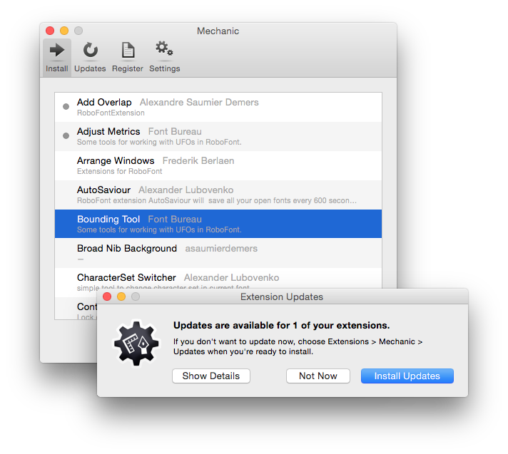
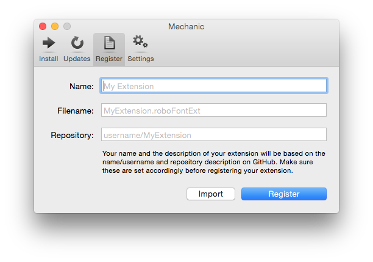

Mechanic
========

Mechanic provides an interface in RoboFont for installing and updating extensions hosted on GitHub.

There are a number of [available extensions](http://robofontmechanic.com) listed on the Mechanic website.

https://github.com/jackjennings/Mechanic



Requirements
------------

Mechanic requires RoboFont 1.5 or greater.

Installation
------------

[Download](https://github.com/jackjennings/Mechanic/archive/master.zip), then double click `Mechanic.roboFontExt`.

Features
--------

* Browse and install extensions from a list of publicly available extensions
* Checks for updates of configured extensions on startup (optional)
* Conditionally ignore individual extensions from being updated
* Optionally ignore small updates on startup
* Manually check for updates of configured extensions
* Register extensions to the public extension registry

Mechanic for Developers
-----------------------

If you are already hosting your code on GitHub, support for Mechanic is easy to add to your existing extension.

* Mechanic assumes that you are releasing on the master branch.
* Mechanic recognizes major, minor, and patch level versions, `X.Y.Z`. Patch level is optional.

Add the following snippet to the `info.plist` file inside of your extension:

```xml
<key>com.robofontmechanic.Mechanic</key>
<dict>
  <key>repository</key>
  <string>username/my-extension</string>
  <key>summary</key>
  <string>A brief description of what this thing does</string>
</dict>
```

Replace `username/my-extension` with your username and the name of the repository that your extension is stored in (e.g. `jackjennings/Mechanic`).

Replace the `summary` string with a description of the extension's functionality.

Once you have added the required keys to your `info.plist` file, you can register your extension from within the Mechanic interface in RoboFont.



Click on "Import", then select your extension from the file selection dialog. If your extension is configured correctly, all of the fields should be populated. Click "Register" to complete the process.

When you register your extension, your name/username and the description of the repository will be recorded from GitHub. This information will be displayed in the list of installable extensions and on the Mechanic website, so make sure that you have set these how you want them to be seen before registering.

You will only need to register once for each extension you want to have listed in the Mechanic installation list. To release new versions in the future, you only need to update the version number in the `info.plist` file and push the changes to GitHub.

Developing Mechanic
-------------------

To run the development version of Mechanic, you'll need to download and run the [mechanic-server](https://github.com/jackjennings/mechanic-server) software.

The `rake` Ruby library is currently used to perform several development tasks. Run `rake -T` to get a list of all defined tasks.

Updates should be made to the files in `src` directory, after which running `rake build` will compile an installable RoboFont extension. Running `rake install` will both build and install the development extension.
